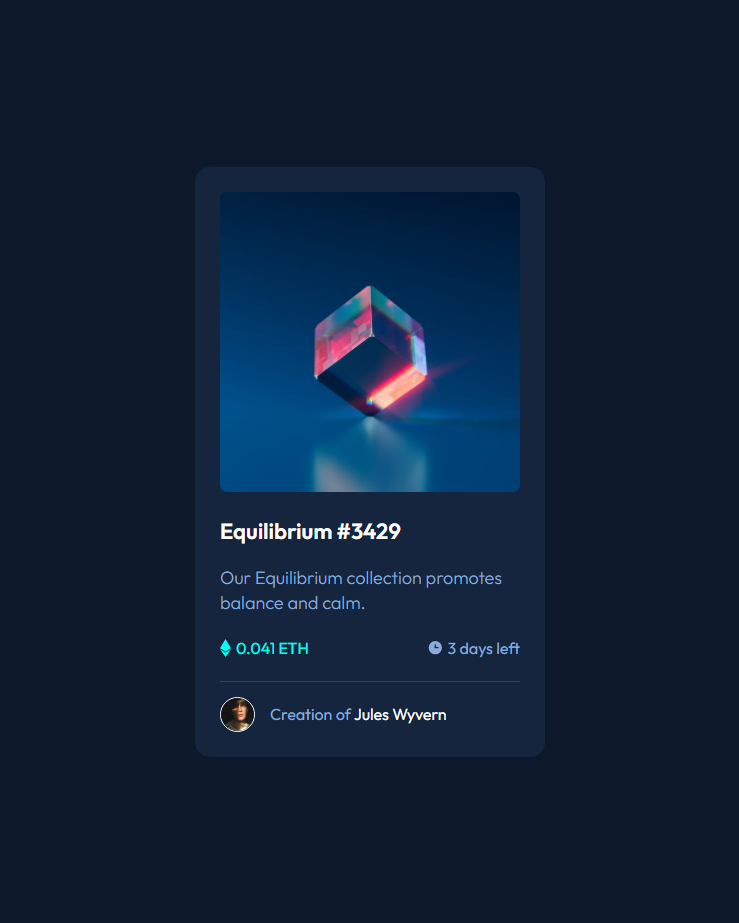

  

<h1 align="center">
  Matías Ezequiel Correa - Workshop - NFT Card Inicial
</h1>

  Este é um projeto sobre um <a href="https://matias-ezequiel-correa.github.io/workshop-nft-card-inicial/" target="_blank">Cartão Inicial NFT</a>, feito com HTML e CSS, atualmente hospedado no <a href="https://github.com/matias-ezequiel-correa">GitHub-Pages</a>.

## Desing: 
[
](https://matias-ezequiel-correa.github.io/workshop-nft-card-inicial/)

### 🔗 Link do Projeto: <a href="https://matias-ezequiel-correa.github.io/workshop-nft-card-inicial/" target="_blank">matias-ezequiel-correa.github.io/workshop-nft-card-inicial/</a>

## Tecnologias utilizadas:

 * HTML
 * CSS

 ### Pra entrar em contato, veja as redes abaixo!
 

 
  
  
   

